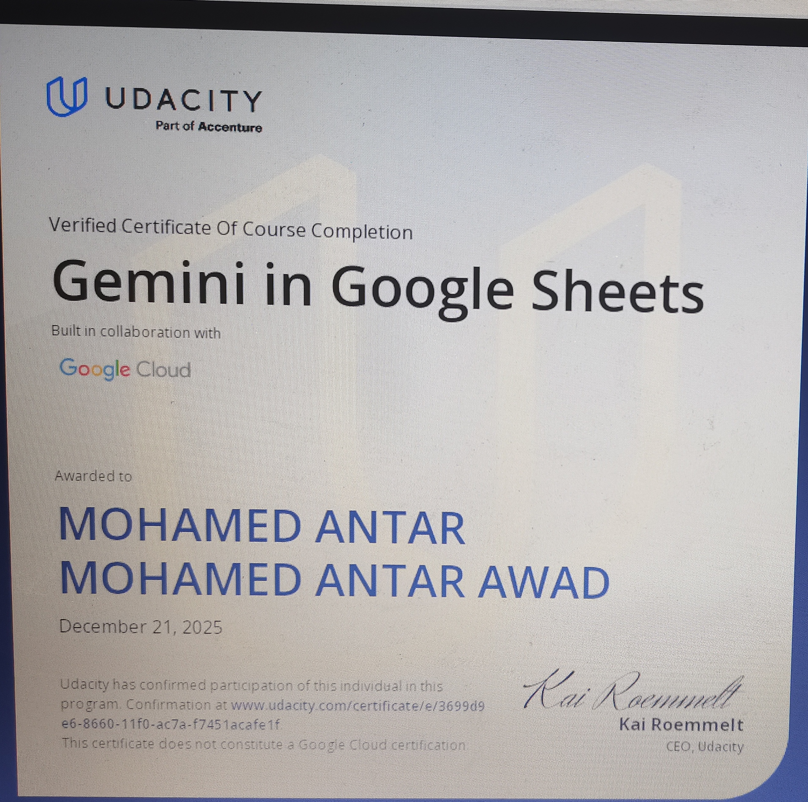
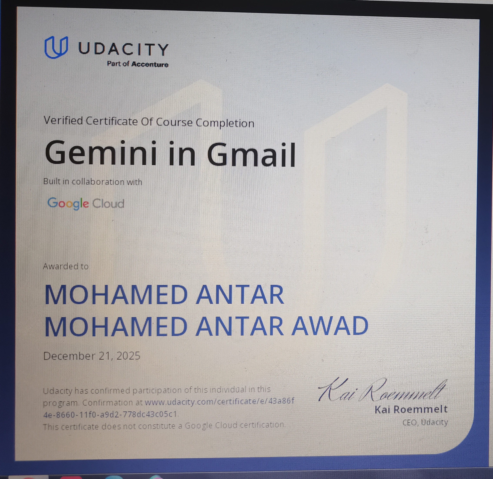
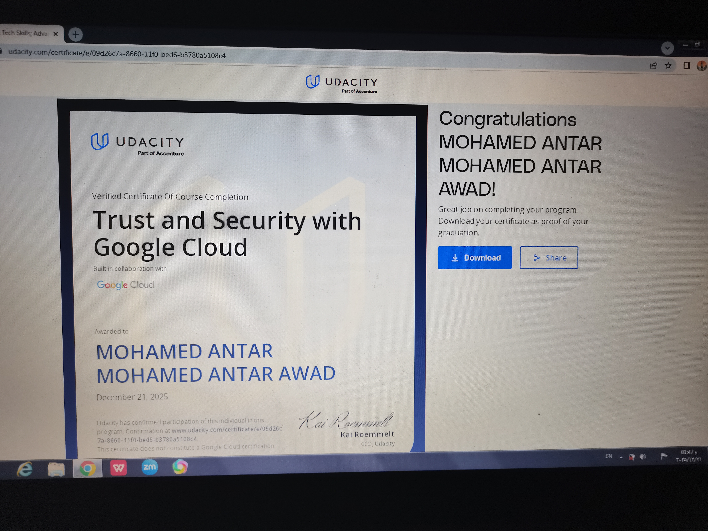
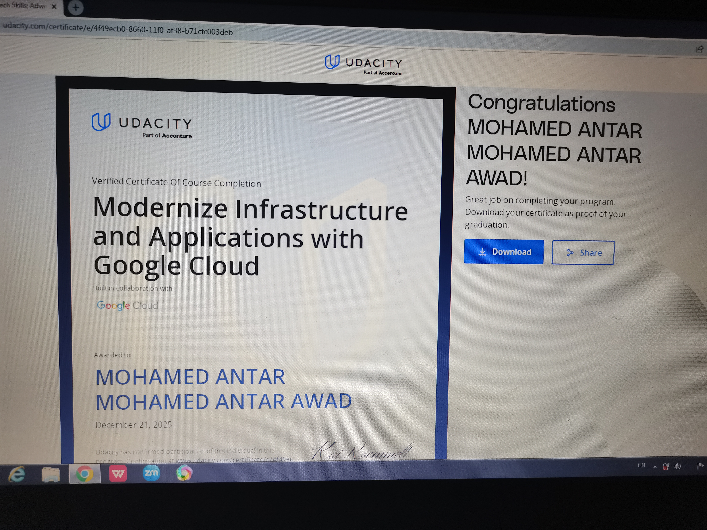
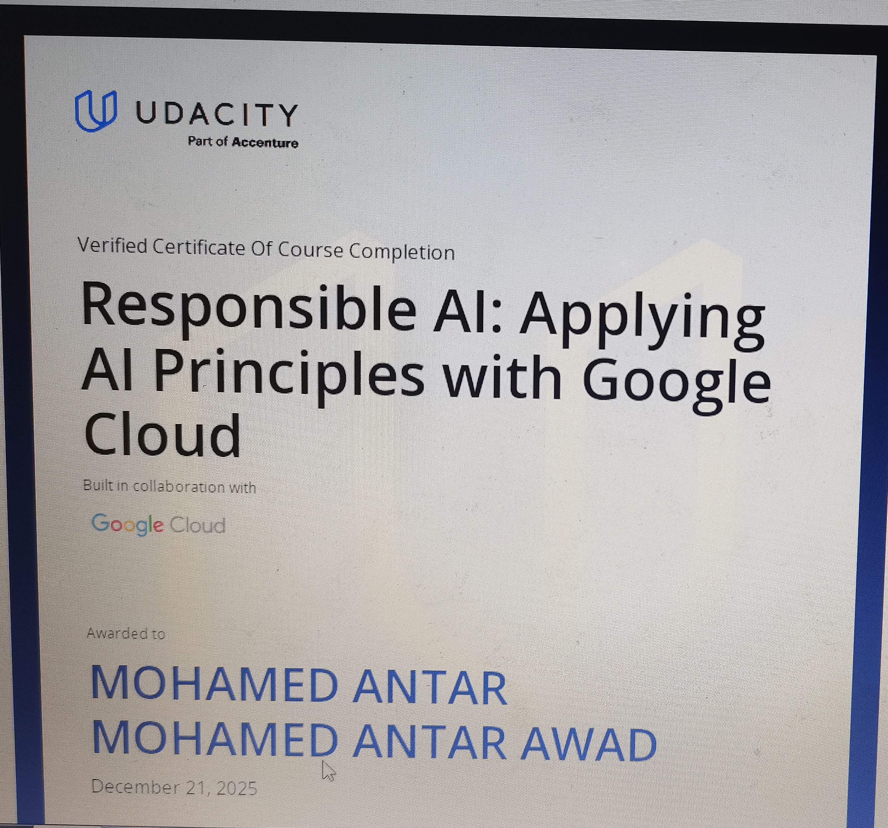
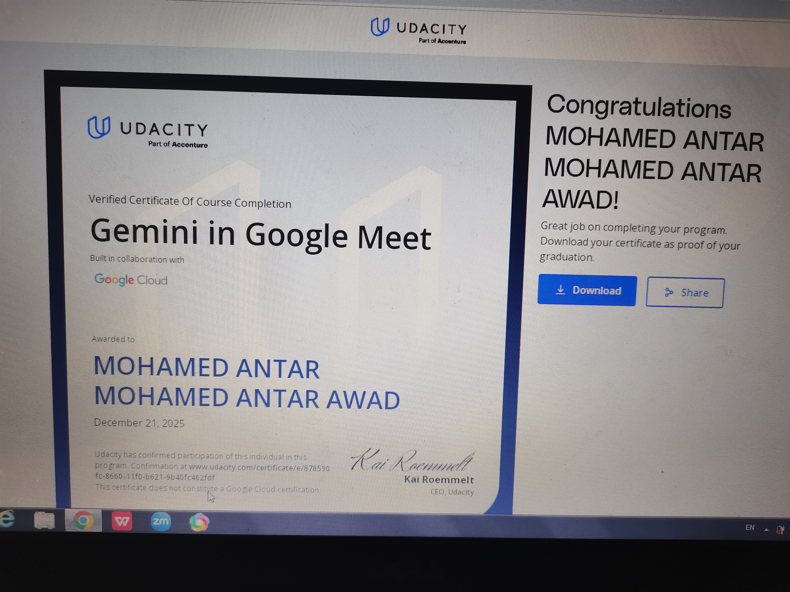
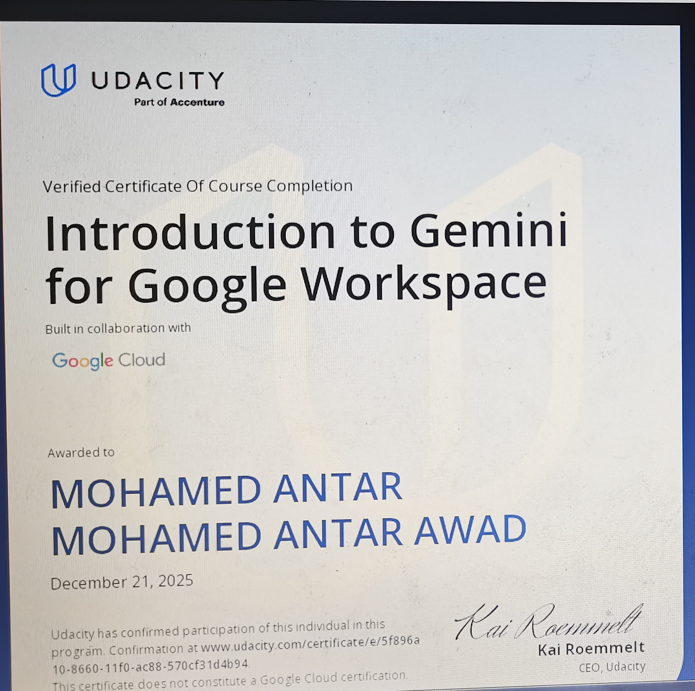
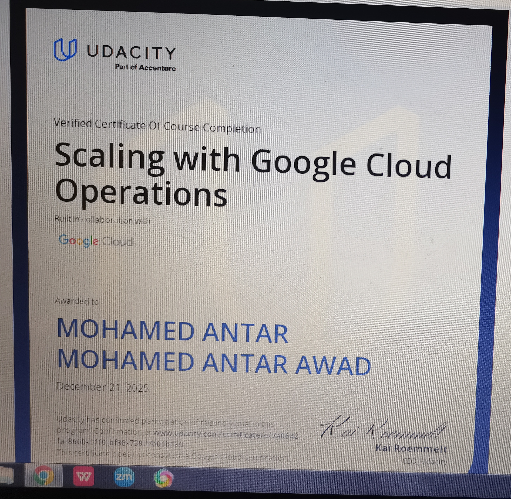
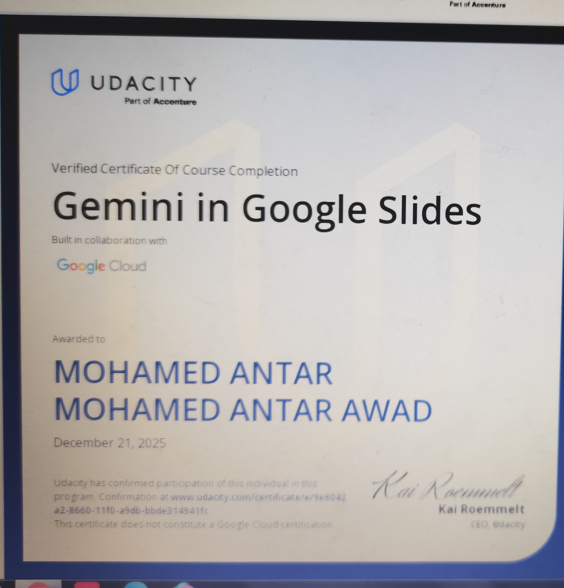

<!DOCTYPE html>
<html lang="en">
<head>
    <meta charset="UTF-8">
    <meta name="viewport" content="width=device-width, initial-scale=1.0">
    <meta name="color-scheme" content="only dark">
    <title>MK CREATIVE Agency | Powered by Mohamed Antar</title>
    
    <link rel="stylesheet" href="https://cdnjs.cloudflare.com/ajax/libs/font-awesome/6.4.0/css/all.min.css">
    <link href="https://fonts.googleapis.com/css2?family=Inter:wght@300;400;600;800&display=swap" rel="stylesheet">
    
    
</head>
<body>

<canvas id="particle-canvas"></canvas>

    <i class="fa-solid fa-shield-halved" style="color: var(--accent); font-size: 1.4rem;"></i>
    

        
MK CREATIVE Agency Security Active

        
Systems online under Mohamed Antar's governance.

    

    

<!-- Quick Search Modal -->

    

        <input type="text" class="search-input" id="search-input-box" placeholder="Search agency systems, CEO profile or team..." oninput="filterSearch()">
        <ul class="search-results-list" id="search-results">
            <li onclick="scrollToSection('about')"><i class="fa-solid fa-building"></i> About MK CREATIVE Agency</li>
            <li onclick="scrollToSection('ceo')"><i class="fa-solid fa-user-tie"></i> CEO & Founder: Mohamed Antar</li>
            <li onclick="scrollToSection('team')"><i class="fa-solid fa-users"></i> Motion Graphics Lead: Malek Mohamed</li>
            <li onclick="scrollToSection('certifications')"><i class="fa-solid fa-award"></i> Verified Google Cloud Certifications</li>
            <li onclick="scrollToSection('projects')"><i class="fa-solid fa-store"></i> Future Mall POS System</li>
            <li onclick="scrollToSection('skills')"><i class="fa-solid fa-code"></i> Enterprise Technical Stack</li>
            <li onclick="scrollToSection('contact')"><i class="fa-solid fa-envelope"></i> Secure Corporate Contact</li>
        </ul>
    

<!-- Detailed Project Modal -->

    

        <button class="close-modal" onclick="closeProjectModal()"><i class="fa-solid fa-xmark"></i></button>
        <h2 id="modal-title" style="color: var(--accent); margin-bottom: 15px;">Project Title</h2>
        

        

        <a href="#" id="modal-link" class="btn" target="_blank"><i class="fa-solid fa-external-link"></i> Launch Agency Demo</a>
    

<header>
    

        

            <i class="fa-solid fa-cube"></i> MK CREATIVE AGENCY
             Secure Node
        

        
        

            
<i class="fa-solid fa-wifi"></i> 19ms

            
<i class="fa-solid fa-cloud-sun"></i> Dakahlia: 32°C

            
<i class="fa-solid fa-clock"></i> 00:00

            
<i class="fa-solid fa-battery-full"></i> 100%

        

        <nav class="nav-links">
            <a href="#about"><i class="fa-solid fa-building"></i> Agency</a>
            <a href="#ceo"><i class="fa-solid fa-user-tie"></i> CEO</a>
            <a href="#team"><i class="fa-solid fa-users"></i> Team</a>
            <a href="#certifications"><i class="fa-solid fa-award"></i> Certifications</a>
            <a href="#projects"><i class="fa-solid fa-layer-group"></i> Solutions</a>
            <a href="#skills"><i class="fa-solid fa-code"></i> Tech Stack</a>
            <a href="#contact"><i class="fa-solid fa-envelope"></i> Contact</a>
        </nav>
    

</header>

    

        🏢 <b>MK CREATIVE AGENCY:</b> High-Performance Cloud Architecture & AI Integration &nbsp;&bull;&nbsp; ♟️ Directed by Mohamed Antar (CEO, 14y) &nbsp;&bull;&nbsp; Press <b>Ctrl + K</b> for Agency Quick Search!
    

<section class="hero" id="about">
    

        <h1>MK CREATIVE Agency</h1>
        

            Empowering Global Business with 
        

        
        

            <i class="fa-solid fa-microchip fa-spin" style="color: var(--accent);"></i> 
            Agency Status: <b>Next-Gen Cloud & AI Frameworks Active</b>
        

        

            MK CREATIVE Agency is a forward-thinking technology corporation specializing in automated retail POS systems, high-retention digital media pipelines, and Google Cloud infrastructure integration.
        

        
        

            <a href="#projects" class="btn"><i class="fa-solid fa-rocket"></i> Explore Solutions</a>
            <a href="#contact" class="btn btn-outline"><i class="fa-solid fa-headset"></i> Partner With Us</a>
        

        

            

                
0

                
Verified Google Cloud Certs

            

            

                
0

                
Million+ Global Views

            

            

                
0

                
Years Young Innovator CEO

            

            

                
0

                
% Secure Infrastructure

            

        

    

</section>

<!-- CEO PROFILE SECTION -->

    <h2 class="section-title">EXECUTIVE LEADERSHIP</h2>
    

        

            

                <i class="fa-solid fa-user-tie"></i>
            

            

                <h3 style="font-size: 1.6rem; color: var(--accent);">Mohamed Antar (محمد عنتر)</h3>
                
Founder & Chief Executive Officer (CEO) • Age 14 • Dakahlia, Egypt

            

        

        

            As the 14-year-old visionary behind MK CREATIVE Agency, Mohamed oversees technical architecture, AI integrations, and high-level software engineering. Holding 10 official certifications from Udacity and Google Cloud, he bridges the gap between advanced cloud operations, automated commercial applications, and viral digital media solutions. He also actively participates as an Admin in strategic chess initiatives within the EGYPT CHESS CLUB.
        

    

<!-- AGENCY TEAM & COLLABORATORS SECTION -->

    <h2 class="section-title">AGENCY TEAM & COLLABORATORS</h2>
    
Key talent who contributed creative excellence to MK CREATIVE Agency projects.

    
    

        

            

                

                    <i class="fa-solid fa-video"></i>
                

                

                    <h3 style="font-size: 1.3rem; color: var(--accent);">Malek Mohamed</h3>
                    
Motion Graphic Designer & Video Editor (Summer Launch)

                

            

            

                Served as the lead Motion Graphic Designer for MK CREATIVE Agency's Summer Launch. Demonstrated exemplary commitment, visual creativity, and professional execution across brand video production and dynamic logo animations.
            

            
            <!-- Added Asmaa Centre Collaboration Video Project -->
            

                <h4 style="color: var(--accent); font-size: 1rem; margin-bottom: 10px;"><i class="fa-solid fa-play-circle"></i> Asmaa Centre Collaboration Project</h4>
                <video controls autoplay muted loop playsinline style="width: 100%; border-radius: 12px; border: 1px solid rgba(255,255,255,0.1); max-height: 450px; object-fit: cover;">
                    <source src="Asmaa Centre collaboration project .mov" type="video/quicktime">
                    <source src="Asmaa Centre collaboration project .mov" type="video/mp4">
                    Your browser does not support the video tag.
                </video>
            

            

                <button class="btn btn-outline" onclick="openLightbox('Screenshot_20260815_210636.jpg')" style="width: 100%; justify-content: center;"><i class="fa-solid fa-award"></i> View Official Internship Certificate (June 29, 2026)</button>
            

        

    

<!-- CERTIFICATIONS SECTION -->

    <h2 class="section-title">VERIFIED AGENCY CERTIFICATIONS</h2>
    
Official credentials awarded by Udacity in collaboration with Google Cloud and Accenture.

    
    

        

            
            <h3 style="color: var(--accent); margin: 15px 0 8px; font-size: 1.1rem;">Gemini in Google Sheets</h3>
            
Google Cloud & Udacity

            <button class="btn btn-outline" onclick="openLightbox('IMG_20251221_133154.jpg')" style="width: 100%; justify-content: center;"><i class="fa-solid fa-eye"></i> View Credential</button>
        

        

            
            <h3 style="color: var(--accent); margin: 15px 0 8px; font-size: 1.1rem;">Gemini in Gmail</h3>
            
Google Cloud & Udacity

            <button class="btn btn-outline" onclick="openLightbox('IMG_20251221_133952_edit_1294679129859207.jpg')" style="width: 100%; justify-content: center;"><i class="fa-solid fa-eye"></i> View Credential</button>
        

        

            
            <h3 style="color: var(--accent); margin: 15px 0 8px; font-size: 1.1rem;">Trust & Security with Google Cloud</h3>
            
Google Cloud & Udacity

            <button class="btn btn-outline" onclick="openLightbox('IMG_20251221_134712.jpg')" style="width: 100%; justify-content: center;"><i class="fa-solid fa-eye"></i> View Credential</button>
        

        

            
            <h3 style="color: var(--accent); margin: 15px 0 8px; font-size: 1.1rem;">Modernize Infrastructure & Apps</h3>
            
Google Cloud & Udacity

            <button class="btn btn-outline" onclick="openLightbox('IMG_20251221_135357.jpg')" style="width: 100%; justify-content: center;"><i class="fa-solid fa-eye"></i> View Credential</button>
        

        

            
            <h3 style="color: var(--accent); margin: 15px 0 8px; font-size: 1.1rem;">Responsible AI: Applying Principles</h3>
            
Google Cloud & Udacity

            <button class="btn btn-outline" onclick="openLightbox('IMG_20260501_100603.jpg')" style="width: 100%; justify-content: center;"><i class="fa-solid fa-eye"></i> View Credential</button>
        

        

            
            <h3 style="color: var(--accent); margin: 15px 0 8px; font-size: 1.1rem;">Gemini in Google Meet</h3>
            
Google Cloud & Udacity

            <button class="btn btn-outline" onclick="openLightbox('IMG_20251221_140439.jpg')" style="width: 100%; justify-content: center;"><i class="fa-solid fa-eye"></i> View Credential</button>
        

        

            
            <h3 style="color: var(--accent); margin: 15px 0 8px; font-size: 1.1rem;">Intro to Gemini for Workspace</h3>
            
Google Cloud & Udacity

            <button class="btn btn-outline" onclick="openLightbox('IMG_20260501_100729.jpg')" style="width: 100%; justify-content: center;"><i class="fa-solid fa-eye"></i> View Credential</button>
        

        

            
            <h3 style="color: var(--accent); margin: 15px 0 8px; font-size: 1.1rem;">Scaling with Cloud Operations</h3>
            
Google Cloud & Udacity

            <button class="btn btn-outline" onclick="openLightbox('IMG_20251221_141142.jpg')" style="width: 100%; justify-content: center;"><i class="fa-solid fa-eye"></i> View Credential</button>
        

        

            
            <h3 style="color: var(--accent); margin: 15px 0 8px; font-size: 1.1rem;">Gemini in Google Slides</h3>
            
Google Cloud & Udacity

            <button class="btn btn-outline" onclick="openLightbox('IMG_20251221_142835_edit_2119882193330690.jpg')" style="width: 100%; justify-content: center;"><i class="fa-solid fa-eye"></i> View Credential</button>
        

    

    <h2 class="section-title">AGENCY SOLUTIONS</h2>
    

        

            <h3><i class="fa-solid fa-store" style="color: var(--accent);"></i> Future Mall POS</h3>
            
Full-stack retail web application featuring role-based access control, AI product classification, and multi-currency frameworks.

            View System Specs &rarr;
        

        

            <h3><i class="fa-solid fa-video" style="color: var(--accent);"></i> Viral Media Engine</h3>
            
Generated over 40M+ views through precision audio-visual balancing, advanced short-form optimization, and high-retention editing.

            View System Specs &rarr;
        

        

            <h3><i class="fa-solid fa-chess-board" style="color: var(--accent);"></i> EGYPT CHESS CLUB (Admin)</h3>
            
Active administration and tactical management within digital strategy communities and club workflows.

            View System Specs &rarr;
        

    

    <h2 class="section-title">AGENCY TECHNICAL STACK</h2>
    

        

            
Cloud Architecture & Security98%

            

        

        

            
Python & Business Software Logic95%

            

        

        

            
Full-Stack Web (HTML/JS/CSS)90%

            

        

        

            
AI Integration & Workspace Automation96%

            

        

    

    <h2 class="section-title">CLIENT PORTALS & VISUAL DESIGNS</h2>
    

        

            <h3 style="color: var(--accent); margin-bottom: 12px; font-size: 1rem;">Asmaa Clinic UI Portal</h3>
            
        

        

            <h3 style="color: var(--accent); margin-bottom: 12px; font-size: 1rem;">Gaming Media Production</h3>
            
        

        

            <h3 style="color: var(--accent); margin-bottom: 12px; font-size: 1rem;">Islam: A Way of Life Interface</h3>
            
        

    

    <h2 class="section-title">SECURE AGENCY COMMUNICATIONS</h2>
    

        
<i class="fa-solid fa-envelope" style="color: var(--accent);"></i> Agency Email: moamedantar8@gmail.com

        
<i class="fa-brands fa-whatsapp" style="color: #22c55e;"></i> Direct Line / WhatsApp: <a href="https://wa.me/201559719175" target="_blank" style="color:var(--accent); text-decoration: none;">+20 155 971 9175</a>

        
<i class="fa-brands fa-linkedin" style="color: var(--accent);"></i> Executive LinkedIn: <a href="https://linkedin.com/in/mohamed-antar-522201406" style="color:var(--accent); text-decoration: none;" target="_blank">mohamed-antar-522201406</a>

        <button class="btn" style="margin-top: 20px;" onclick="copyEmail()"><i class="fa-solid fa-copy"></i> Copy Agency Email</button>
    

    <button class="float-btn" onclick="toggleMatrixMode()" title="Toggle Matrix Secure Mode"><i class="fa-solid fa-code"></i></button>
    <button class="float-btn" onclick="toggleAmberMode()" title="Toggle Amber E-Ink Mode"><i class="fa-solid fa-moon"></i></button>
    <button class="float-btn" id="audio-toggle-btn" onclick="toggleAudioFX()" title="Toggle Audio Sound FX"><i class="fa-solid fa-volume-high"></i></button>

<!-- Rocket Top Button -->
<button class="rocket-top-btn" id="rocketBtn" onclick="launchToTop()" title="Scroll to Top">
    🚀
</button>

<!-- Mobile Search Float Button -->
<button class="mobile-search-float" onclick="openSearchModalMobile()" title="Quick Search">
    <i class="fa-solid fa-magnifying-glass"></i>
</button>

<footer>
    
&copy; 2026 MK CREATIVE Agency. Founded and Directed by Mohamed Antar. All Rights Reserved.

</footer>

</body>
</html> 
