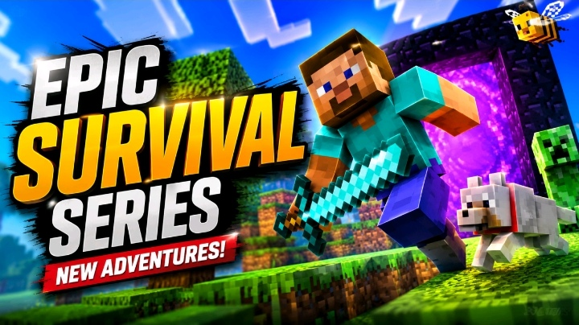

<!DOCTYPE html>
<html lang="en">
<head>
    <meta charset="UTF-8">
    <meta name="viewport" content="width=device-width, initial-scale=1.0">
    <title>Mohamed Antar | Ultimate Cyber Portfolio</title>
    <!-- FontAwesome for Icons -->
    <link rel="stylesheet" href="https://cdnjs.cloudflare.com/ajax/libs/font-awesome/6.4.0/css/all.min.css">
    
</head>
<body>

<!-- Scroll Progress Bar -->

<!-- Welcome Toast Notification -->

    <i class="fa-solid fa-rocket" style="color: var(--accent); font-size: 1.3rem;"></i>
    

        
Welcome to the 40-Feature Elite Site!

        
Explore Mohamed Antar's Ultimate Cyber Portfolio.

    

<!-- Lightbox Container -->

    

<!-- Header / Navbar -->
<header>
    

        

            <i class="fa-solid fa-code"></i> Mohamed Antar
             Available for Work
        

        <nav class="nav-links">
            <a href="#about"><i class="fa-solid fa-user"></i> About</a>
            <a href="#projects"><i class="fa-solid fa-layer-group"></i> Powerhouse</a>
            <a href="#gallery"><i class="fa-solid fa-photo-film"></i> Showcase</a>
            <a href="#contact"><i class="fa-solid fa-envelope"></i> Contact</a>
        </nav>
    

</header>

<!-- Hero Section -->
<section class="hero" id="about">
    

        <h1>Mohamed Antar</h1>
        

            Architecting 
        

        

            A 14-year-old tech builder, video editor, and software engineer merging high-retention digital media pipelines with robust web architectures.
        

        
        

            <a href="https://youtube.com/@mo7amed_5272" class="btn" target="_blank"><i class="fa-brands fa-youtube"></i> MK GAMES PRO</a>
            <a href="https://youtube.com/@mo7amed_5277" class="btn btn-outline" target="_blank"><i class="fa-brands fa-youtube"></i> MK QURAN</a>
        

        <!-- Animated Stats Counter -->
        

            

                
0

                
Million+ Views & Remixes

            

            

                
0

                
Published Videos

            

            

                
0

                
Years Old Developer

            

        

    

</section>

<!-- Projects Powerhouse -->

    <h2 class="section-title">OUR POWERHOUSE</h2>
    

        

            <h3><i class="fa-solid fa-store" style="color: var(--accent);"></i> Future Mall</h3>
            
Full-stack retail web application featuring role-based access control, AI product classification, and multi-currency support.

        

        

            <h3><i class="fa-solid fa-video" style="color: var(--accent);"></i> Viral Media Engine</h3>
            
Generated over 40M+ views through precision audio-visual balancing, advanced short-form optimization, and high-retention editing.

        

        

            <h3><i class="fa-solid fa-terminal" style="color: var(--accent);"></i> Python Automation</h3>
            
Custom backend scripts and smart automation workflows built for maximum production efficiency and AI model integrations.

        

    

<!-- Creative Showcase Gallery (Including Minecraft & Islam designs) -->

    <h2 class="section-title">CREATIVE SHOWCASE & WORKS</h2>
    

        

            <h3 style="color: var(--accent); margin-bottom: 12px; font-size: 1.1rem;">Asmaa Clinic Design</h3>
            
        

        

            <h3 style="color: var(--accent); margin-bottom: 12px; font-size: 1.1rem;">Minecraft Thumbnail</h3>
            
        

        

            <h3 style="color: var(--accent); margin-bottom: 12px; font-size: 1.1rem;">Islam: A Way of Life (1)</h3>
            
        

        

            <h3 style="color: var(--accent); margin-bottom: 12px; font-size: 1.1rem;">Islam: A Way of Life (2)</h3>
            
        

    

<!-- Contact Section -->

    <h2 class="section-title">CONTACT INFO</h2>
    

        
<i class="fa-solid fa-envelope" style="color: var(--accent);"></i> Email: moamedantar8@gmail.com

        
<i class="fa-brands fa-whatsapp" style="color: #22c55e;"></i> WhatsApp: <a href="https://wa.me/201559719175" target="_blank" style="color:var(--accent); text-decoration: none;">+20 155 971 9175</a>

        
<i class="fa-brands fa-linkedin" style="color: var(--accent);"></i> LinkedIn: <a href="https://linkedin.com/in/mohamed-antar-522201406" style="color:var(--accent); text-decoration: none;" target="_blank">mohamed-antar-522201406</a>

        <button class="btn" style="margin-top: 20px;" onclick="copyEmail()"><i class="fa-solid fa-copy"></i> Copy Email Address</button>
    

<!-- Floating Controls -->

    <button class="float-btn" onclick="toggleTheme()" title="Toggle Light/Dark Theme"><i class="fa-solid fa-circle-half-stroke"></i></button>
    <button class="float-btn" onclick="scrollToTop()" title="Back to Top"><i class="fa-solid fa-arrow-up"></i></button>

<footer>
    
&copy; 2026 Mohamed Antar. Built with absolute precision, code, and passion.

</footer>

<!-- JavaScript Enhancements -->

</body>
</html> 
